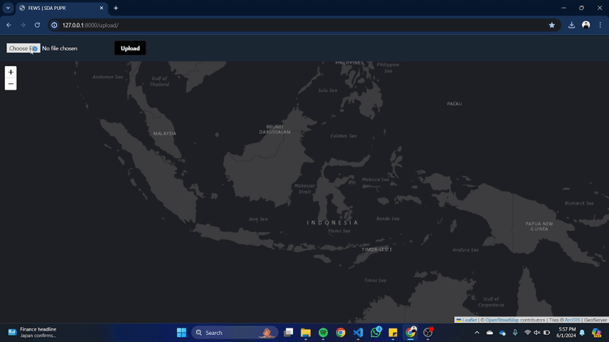

# Flood Early Warning System

Flood Early Warning System (FEWS) is an application developed by the Ministry of Public Works and Housing to predict floods and their inundation areas in Indonesia. The trial uses GeoServer, an open-source server written in Java, which enables users to share, process, and edit geospatial data. Designed for interoperability, GeoServer publishes data from various sources using open standards.

The data sharing features in this trial include:

- **WMS (Web Map Service)**: Displaying maps dynamically via the web.
- **WFS (Web Feature Service)**: Sharing geospatial feature data via the web.

## Tech Stack

Django, PostgreSQL, GeoServer, Axios, TailwindCSS.

## Run Locally

Clone the project

```bash
git clone https://github.com/Gerardusdavidbayuaji/flood_early_warning_system.git
```

Go to the project directory

```bash
cd flood_early_warning_system
```

Set Up a Virtual Environment

```bash
python -m venv .venv
source .venv/bin/activate
```

Install Python Dependencies

```bash
pip install -r requirements.txt
```

Run Server

```bash
python backend/manage.py migrate
http://127.0.0.1:8000/upload/
```

## Live Demo

Web Map Service


Web Feature Service

